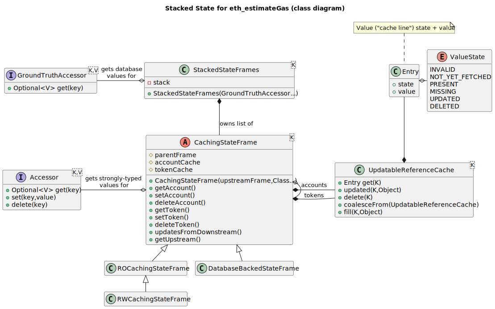
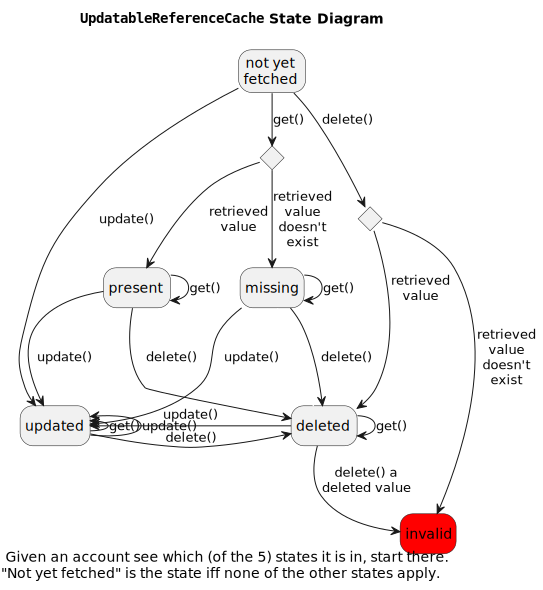

#`StackedStateFrames` and `UpdatableReferenceCache`

# The `StackedStateFrames` for caching Hedera objects during contract execution

## Overview

The purpose of this is to support _eth_call_ and _eth_estimateGas_, both of which can update Hedera domain objects while executing contracts, but that updated Hedera state is never persisted past a contract's execution (and certainly _not_ to the database).

As each contract executes its changes to Hedera state must be kept: later execution may refer to the same Hedera object and want the updated state. This also applies as contracts call other contracts. However, in a call to another contract, that call can either succeed or fail. In the success case changes to Hedera objects made by the _called_ contract are kept so that the caller can see them. But in the failure case ("revert") those changes must be thrown away so that the caller does _not_ see them.

The _eth_estimateGas_ call is more complicated: It must do a _search_ for the proper amount of gas (for various complicated reasons) and it does that by calling the contract multiple times with the same arguments but different amount of allowable gas, in order to search for the closest gas estimate it can find that works. Each of those calls must access the same Hedera state no matter how many blocks have come in during the multiple executions of the same contract.

## The Stacked State Frames: Principles of Operation

A _stacked state frames_ is a multi-level cache that provides "layered" "frame-based" caching with limited writes being allowed upstream.

The most **up**stream cache is simply a pass-through-only accessor of
ground truth - usually to a database. Given a key it will call the
ground truth provider and return whatever is the there - either an actual
value, or "missing".

The database layer does no _caching_ at all, but stacked on top of it is
a _read only_ cache that passed through _missing reads_ to the upstream
database layer and then holds the returned value. All subsequent reads
of that key will be returned directly from the RO cache.

These two layers form the _stack base_. This base is _reused_ over the multiple-calls to the _same contract_ with the _same parameters_ and the _same Hedera state_ during a single call to _eth_estimateGas_.

Above the stack base comes read-write cache levels, one for each contract call in progress. They're like call-frames, but hold only Hedera state
objects. As each nested contract call is made a new empty one is pushed onto the stack, using the previous top-of-stack as its upstream cache.

At any time the cache can return values that it holds, or, if it knows that it has never been asked for a value, it will call its upstream asking for that value, and on return, store it.

When a contract call completes successfully you _commit_ its Hedera state changes to its upstream. If the contract call fails you simply pop the top of the stack and throw it away. You never commit to the stack base (the RO cache frame there) - or if you do, it will fail.

## What are the allowable states of a cache line?

Each frame of the cache will track key/value pairs according to the
following states:

|       State       | Description                                                                                                                                |
| :---------------: | :----------------------------------------------------------------------------------------------------------------------------------------- |
| `NOT_YET_FETCHED` | The key has not yet be requested at this cache level. Immediately defer to the upstream cache to see what it thinks.                 |
|     `MISSING`     | There's no value for this key in the upstream cache (we've already looked).                                                             |
|     `PRESENT`     | Value exists in the upstream cache, here it is. It hasn't  been changed at this level.                                                  |
|     `UPDATED`     | Value has been updated here at this level. (Don't know at this point if it existed upstream: It could be new.)                       |
|     `DELETED`     | Value has been deleted at this level. May have existed upstream, or, may have been created here and then deleted at this same level. |

(There's also an `INVALID` state that would indicate a logic error within the cache if you ever ran across it.)

### Important Usage Note: This _wants_ to be a cache of _values_ but in fact is a cache of _references_ - the user must be _cautious_!

These caches cache _references_ to things. They should really, really only be used to cache _immutable value-like_ entities. Otherwise, if you actually _modify_ an entities' state you'll modify it not only in the top-level cache but in the lower-caches _which breaks the "commit" feature_. The implementation will attempt to detect, at runtime, that you're trying to update an entry with the same value (i.e., reference) that's already in the cache - which probably indicates that you modified the state and are attempting to update the cache with it.

- An alternate solution would be to immediately _wrap_ underlying R/W entities in R/O wrappers and then use them exclusively.

## A few diagrams to help this description out

### Object diagram for a contract call with an inner call

### Class diagram of `StackedStateFrames` components

### State diagram for `UpdatableReferenceCache`

### Decision diagram for `UpdateableReferenceCache`

#### _(method,state) ⮕ action_

